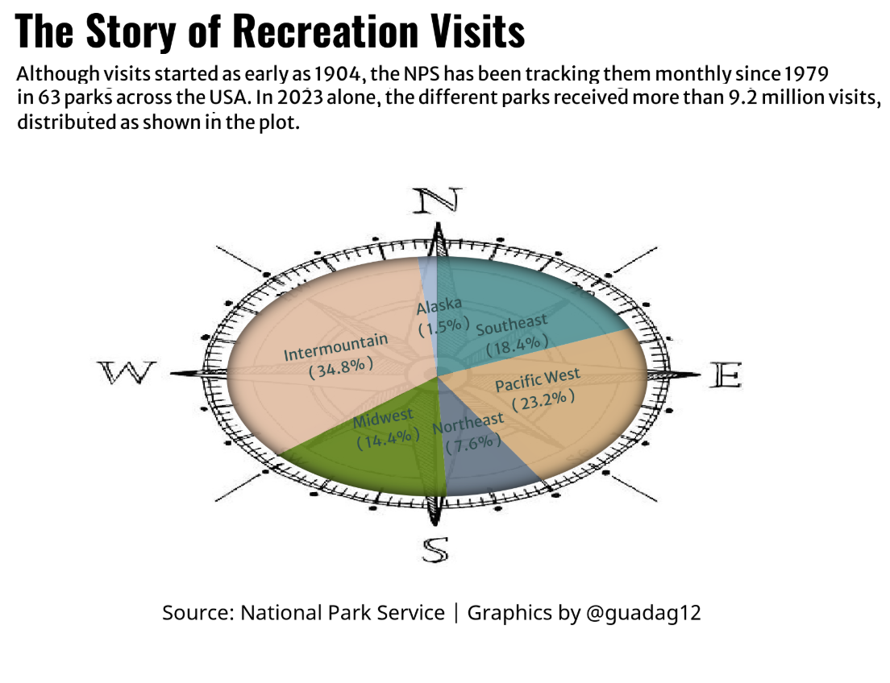

```{r setup, include=FALSE}
knitr::opts_chunk$set(echo = FALSE)
```

I've always been intrigued by how people use their spare time. The contest from the Big Ten Academic Alliance greatly helped me explore this topic using R. I took this opportunity to learn more about time use and discover what I had been missing in terms of visualization techniques.

The plots I created are organized by region, so let's review which regions belong where on the US Map from the website of [Park Chasers](https://www.parkchasers.com/find-your-park/parks-by-region/):


Now that we can identify regions on the map, let's start with a pie chart. I know the data science community might disapprove—pie charts ([1](https://medium.com/analytics-vidhya/dont-use-pie-charts-in-data-analysis-6c005723e657)), but I wanted to experiment with inserting an image as a background and overlaying a plot on it. The compass seems perfect for this. The first plot shows that the most visited parks in 2023 were in the Intermountain (34.8%) and Pacific West (23.32%) regions, which is logical since they include Yellowstone, Grand Canyon, Yosemite, and Olympic National Park. Conversely, the Alaska region, with only 1.5%, features fascinating wilderness areas but is remote, less accessible, and has harsher climates than other continental parks. Let's look at the plot:



Here's the code for replication:

```{r, code_folding=TRUE, eval=FALSE}
rm(list = ls())

# Load Libraries ------------------------------------------------------------

pacman::p_load(
  ggplot2,         # Easily Install and Load the 'Tidyverse'
  grid,            # Improved Text Rendering Support for 'ggplot2'
  ggpath,          # Using Fonts More Easily in R Graphs
  jpeg,           # Simple Tools for Examining and Cleaning Dirty Data
  magick,             # Compact and Flexible Summaries of Data
  ggimage,            # Scale Functions for Visualization
  gganimate,         # Make Dealing with Dates a Little Easier
  ggtext,              # Interpreted String Literals
  stringr,               # Pixel Filters for 'ggplot2' and 'grid' # Pixel Filters for 'ggplot2' and 'grid' 
  glue,
  htmlwidgets,
  webshot
  )  

# Configuration Plot ------------------------------------------------------

font_add_google("Oswald", "title")
font_add_google("Merriweather Sans", "subtitle")
font_add_google("Merriweather Sans", "text")
font_add_google("Noto Sans", "caption")
showtext_auto(enable = TRUE)

img = "C:/Users/User/Documents/GitHub/2025_Data_Viz_Championship/compass2.jpg"

fa_path <- systemfonts::font_info(family = "Font Awesome 6 Brands Regular")[["path"]]
font_add(family = "fa-brands", regular = fa_path)

subtitle_text <- str_glue("Although visits started as early as 1904, the NPS has been tracking them monthly since 1979 \n in 63 parks across the USA. In 2023 alone, the different parks received more than 9.2 million visits, \n distributed as shown in the plot.")

caption_text  <- str_glue("{tt} <span style='font-family:fa6-brands'>&#xf08c;</span> guadag12 &bull; {tw} @guadag12 ; {gi} @guadag12")

region_colors <-  c("Alaska" = "#B0C4DE", "Intermountain" = "#EDC9AF", 
                    "Midwest" = "#6B8E23", "Northeast" = "#708090", 
                    "Pacific West" = "#DEB887", "Southeast" = "#5F9EA0")


theme_update(
  plot.title.position   = "plot",
  plot.caption.position = "plot",
  legend.position       = 'plot',
  plot.background       = element_rect(fill = bkg_col, color = bkg_col),
  panel.background      = element_rect(fill = bkg_col, color = bkg_col),
  plot.margin           = margin(t = 10, r = 20, b = 10, l = 20),
  
  axis.title.x          = element_text(margin = margin(10, 0, 0, 0), size = rel(1.1), 
                                       color = text_col, family = "text", face = "bold", hjust = 0.5),
  axis.title.y          = element_text(margin = margin(10, 0, 0, 0), size = rel(1.1), 
                                       color = text_col, family = "text", face = "bold", hjust = 0.5,
                                       angle = 90),  
  axis.text.y           =  element_text(color = text_col, family = "text", size = rel(0.9)),
  axis.text.x           = element_text(color = text_col, family = "text", size = rel(0.9)),
  axis.ticks.x          = element_line(color = text_col),  # Show x-axis ticks
  panel.grid            = element_blank(),
  strip.text            = element_blank() # Remove strip text 
)

region_colors <-  c("Alaska" = "#B0C4DE", "Intermountain" = "#EDC9AF", 
                    "Midwest" = "#6B8E23", "Northeast" = "#708090", 
                    "Pacific West" = "#DEB887", "Southeast" = "#5F9EA0")

# Plot --------------------------------------------------------------------

p <-NPData %>%
  group_by(Region) %>%
  summarise(total_visit = sum(RecreationVisits)) %>%
  mutate(prop = total_visit / sum(total_visit) * 100) %>%
  mutate(ypos = cumsum(prop) - 0.7 * prop) %>%
  mutate(ypos_mod = case_when(
    round(ypos, 1) == 0.450 ~ -10,
    round(ypos, 1) == 87.1 ~ 12.9 ,
    round(ypos, 1) == 65.3 ~ 28.7 ,
    round(ypos, 1) == 53.0 ~ 45.0,
    round(ypos, 1) == 40.7 ~ 58.3,
    round(ypos, 1) == 11.9  ~ 80.1,
    TRUE ~ ypos
  )) %>%
  ggplot( aes(x="", y=prop, fill=Region)) +
  with_inner_glow(
  geom_bar(stat="identity", width=0.01, alpha =.95) ,
  color = "gray10", sigma = 15
  ) +
  coord_polar("y", start=0) + 
  theme_void() +
  labs(
    title = "The Story of Recreation Visits",
    subtitle = subtitle_text,
    caption = "Source: National Park Service | Graphics by @guadag12"
  ) +
  scale_fill_manual(values = region_colors) +  
  force_panelsizes(rows = unit(2, "in"), cols = unit(3.5, "in")) +
  theme(
    plot.background = element_rect(fill = "transparent", colour = NA),
    panel.background = element_rect(fill = "transparent", colour = NA), 
    plot.margin = unit(c(-1.3, 1.7, 0, 0), "cm"),
    panel.spacing = unit(c(0.5, 0, 0, 0), "cm"),
    legend.position = "none",
    plot.title = element_text(family = "title", size = 20, face = "bold", vjust = 13,hjust = -10),
    plot.subtitle = element_text(family = "subtitle", size = 9, vjust = 20, hjust = 0.5),
    plot.caption = element_text(family = "caption", size = 10, vjust = -15),
  )
ggbackground(p + geom_text(
  aes(y = ypos_mod,  label = paste(Region, "\n (", sprintf("%.1f%%", prop), ")"), group = Region, angle = 10), 
  size = 2.5,
  check_overlap = F, 
  color = "#2F4F4F", family = "text") , img)

#webshot::install_phantomjs(force = T)
webshot("http://localhost:31220/session/preview.html", file = "viewer_screenshot.png")

```

However, knowing which National Parks were most visited in 2023 is not enough to understand how people spend their time. What if we use a line plot to observe the evolution of recreational visits to National Parks, differentiated by region?

Inspired by [this visualization](https://x.com/sponce1/status/1838881981351821547), the second plot includes this information but with a twist: the names of the parks appear in gigantic letters on the plot.


This second plot displays the trends in recreational visits (in millions) to National Parks across various U.S. regions from 1980 to 2023. Each line represents a region and shows how visitation has changed over 40 years. Notably, all regions have seen an increase in the number of visitors over the decades, particularly around 2010 and just before the pandemic. The pandemic led to a significant reduction in visits, followed by a rebound, possibly as lockdowns increased people's desire to spend more time in nature.

Here's the code for replication:

```{r, code_folding=TRUE, eval=FALSE}
options(scipen = 999)
rm(list =ls())

pacman::p_load(
  tidyverse,         # Easily Install and Load the 'Tidyverse'
  ggtext,            # Improved Text Rendering Support for 'ggplot2'
  showtext,          # Using Fonts More Easily in R Graphs
  janitor,           # Simple Tools for Examining and Cleaning Dirty Data
  skimr,             # Compact and Flexible Summaries of Data
  scales,            # Scale Functions for Visualization
  lubridate,         # Make Dealing with Dates a Little Easier
  glue,              # Interpreted String Literals
  ggfx               # Pixel Filters for 'ggplot2' and 'grid' # Pixel Filters for 'ggplot2' and 'grid' 
)  
camcorder::gg_record(
  dir    = here::here("temp_plots"),
  device = "png",
  width  =  7.5,
  height =  5,
  units  = "in",
  dpi    = 320
)

### |- resolution ----
showtext_opts(dpi = 320, regular.wt = 300, bold.wt = 800)


# Transformation ----------------------------------------------------------

NPData<- read.csv("https://raw.githubusercontent.com/melaniewalsh/responsible-datasets-in-context/main/datasets/national-parks/US-National-Parks_RecreationVisits_1979-2023.csv")
NPData_groupby <- NPData %>%
  group_by(Region, Year) %>%
  summarise(total_visits = sum(RecreationVisits))

unique(NPData_groupby$Region)
labels <- tibble(
  label = c("Alaska", "Intermountain", "Midwest", "Northeast", "Pacific West",
            "Southeast"),
  player = c("Alaska", "Intermountain", "Midwest", "Northeast", "Pacific West",
             "Southeast"),
  x = c(2000, 2000, 2000, 2000, 2000, 2000), 
  y = c(0.0001, 0.0001, 0.0001, 0.0001, 0.0001, 0.0001) 
)

# Configuration Plot -----------------------------------------------------------

loadfonts(device = "win")  # Usa device = "win" para Windows, "quartz" para Mac, y "cairo" para Linux

bkg_col      <- colorspace::lighten('#ffffff', 0.05)    
title_col    <- "gray20"           
subtitle_col <- "gray20"     
caption_col  <- "gray30"   
text_col     <- "gray20"    
col_palette  <- paletteer::paletteer_d("peRReo::don")[c(1:6)]

### |-  titles and caption ----
# text
title_text    <- str_glue("The evolution of Recreational Visits to National Parks")
subtitle_text <- str_glue("How the number of visits to national parks has evolved over the last 45 years in the US")
caption_text <-paste0("Source: National Park Service | Graphics by @guadag12")

### fonts ----
font_add_google("Oswald", "title")
font_add_google("Merriweather Sans", "subtitle")
font_add_google("Merriweather Sans", "text")
font_add_google("Noto Sans", "caption")
showtext_auto(enable = TRUE)

### plot theme ----
theme_set(theme_minimal(base_size = 14, base_family = "text"))                

theme_update(
  plot.title.position   = "plot",
  plot.caption.position = "plot",
  legend.position       = 'plot',
  plot.background       = element_rect(fill = bkg_col, color = bkg_col),
  panel.background      = element_rect(fill = bkg_col, color = bkg_col),
  plot.margin           = margin(t = 10, r = 20, b = 10, l = 20),
  
   axis.title.x         = element_text(margin = margin(10, 0, 0, 0), size = rel(1.1), 
                                       color = text_col, family = "text", face = "bold", hjust = 0.5),
  axis.title.y          = element_text(margin = margin(10, 0, 0, 0), size = rel(1.1), 
                                       color = text_col, family = "text", face = "bold", hjust = 0.5,
                                       angle = 90),  
  axis.text.y           = element_text(color = text_col, family = "text", size = rel(0.9)),
  axis.text.x           = element_text(color = text_col, family = "text", size = rel(0.9)),
  axis.ticks.x          = element_line(color = text_col),  # Show x-axis ticks
  panel.grid            = element_blank(),
  strip.text            = element_blank() # Remove strip text 
)


# Plot --------------------------------------------------------------------

region_colors <-  c("Alaska" = "#B0C4DE", "Intermountain" = "#EDC9AF", 
                   "Midwest" = "#6B8E23", "Northeast" = "#708090", 
                    "Pacific West" = "#DEB887", "Southeast" = "#5F9EA0")
NPData_groupby <- NPData_groupby %>%
  rename(player=Region)
plot <- ggplot(NPData_groupby, aes(x = Year, y = total_visits)) +
  # Reference text layer
  as_reference(
    geom_text(
      data = labels, aes(x = x, y = y, label = label),
      inherit.aes = FALSE,
      family = "title", colour = "gray10", size = rel(10), hjust = 0.5, vjust = 0,
        
    ),
    id = "text"
  ) +
  
  # Blending the text with the density plot
  with_inner_glow(
    with_blend(
      geom_area(aes(fill = player, color = player),
                   alpha = 1, show.legend = FALSE#,
                  # bw = 25,
                  # kernel = "epanechnikov"
      ),
      bg_layer = "text", blend_type = "xor"
    ),
    color = "gray10", sigma = 15
  ) +
  
  # Labs
  labs(
    x = "Year",
    y = "Total Visits",
    title = title_text,
    subtitle = subtitle_text,
    caption = caption_text
  ) +
  
  # Scales
  scale_x_continuous() +
  scale_y_continuous( labels = label_number(suffix = " M", scale = 1e-6)) +
  scale_fill_manual(values = col_palette) +
  scale_color_manual(values = col_palette) +
  coord_cartesian(clip = "off") +
    scale_fill_manual(values = region_colors) +  

  
  # Facet
  facet_wrap(~player, ncol = 2) +
  
  # Facet
  theme(
    plot.title = element_text(
      size = rel(1.55),
      family = "title",
      face = "bold",
      color = title_col,
      lineheight = 1.1,
      margin = margin(t = 5, b = 5)
    ),
    plot.subtitle = element_text(
      size = rel(0.85),
      family = "subtitle",
      color = subtitle_col,
      lineheight = 1.1,
      margin = margin(t = 5, b = 5)
    ),
    plot.caption = element_markdown(
      size = rel(0.50),
      family = "caption",
      color = caption_col,
      lineheight = 1.1,
      hjust = 0.5,
      halign = 1,
      margin = margin(t = 5, b = 5)
    )
  )
```

In conclusion, it is wonderful to see that more people are spending their time outside and this exploration is critical during 2010 and after the pandemic, as it created a new necessity of connecting more with nature. 

Last but not least, I want to share with you a a photo of me after a 4-hour, 14-km trek at the [Otto Meiling Refuge](https://refugiomeiling.com/) in Nahuel Huapi National Park, Argentina:


