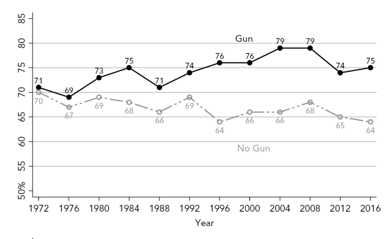
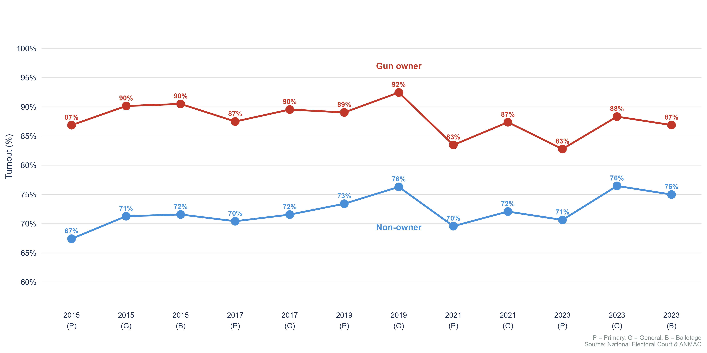
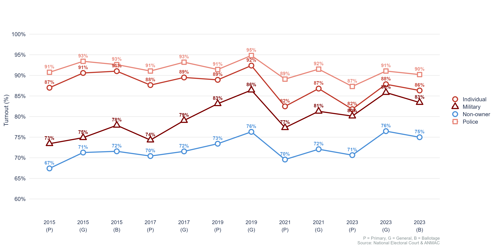
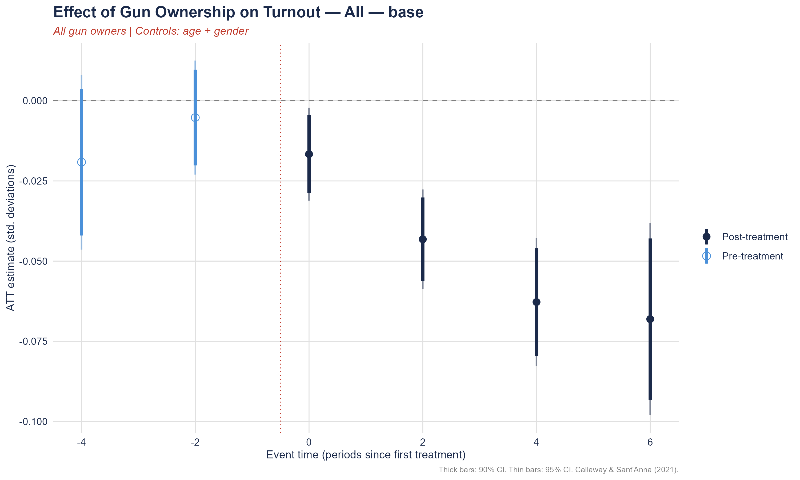
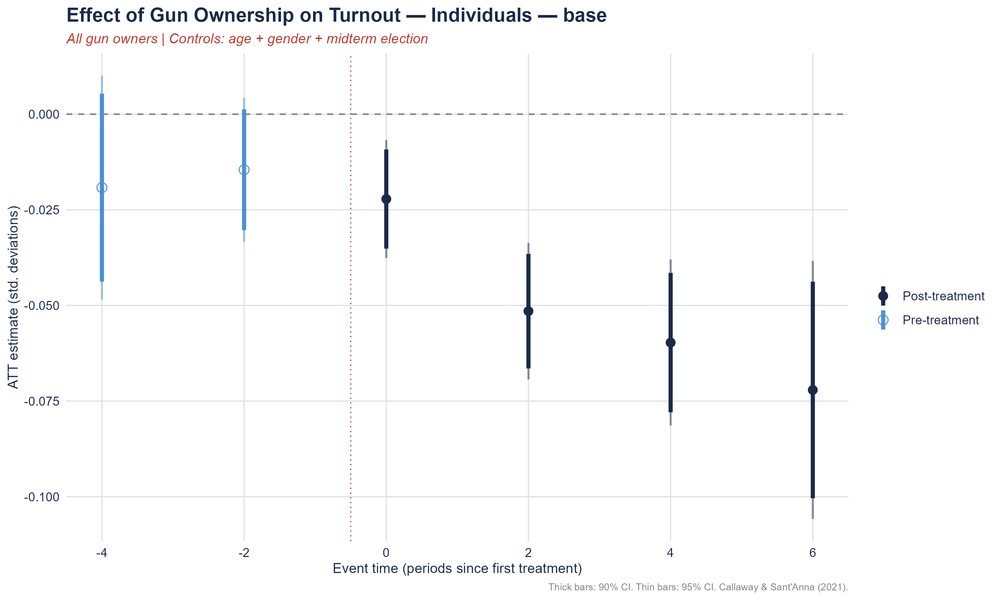
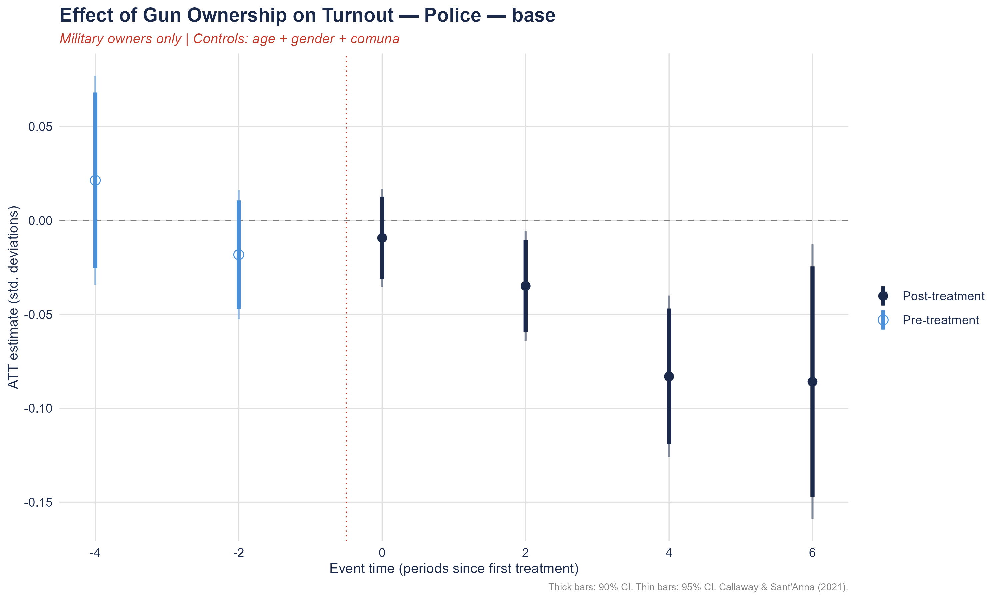
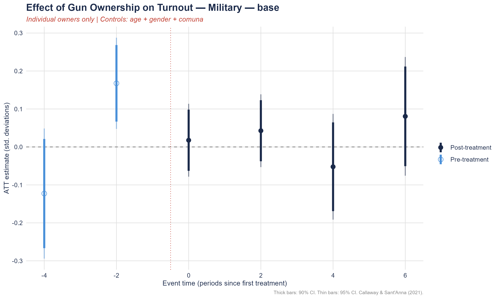
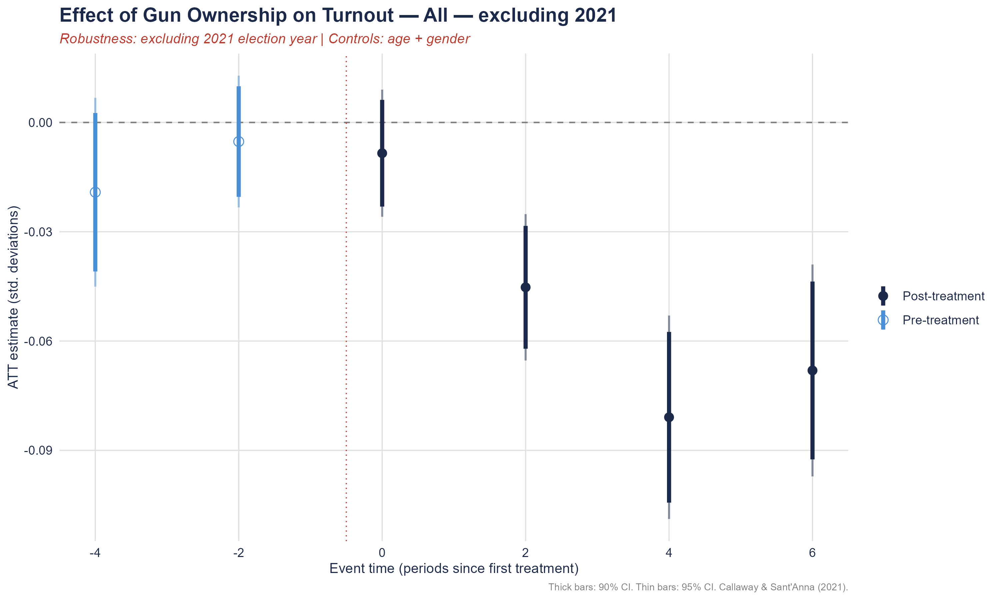
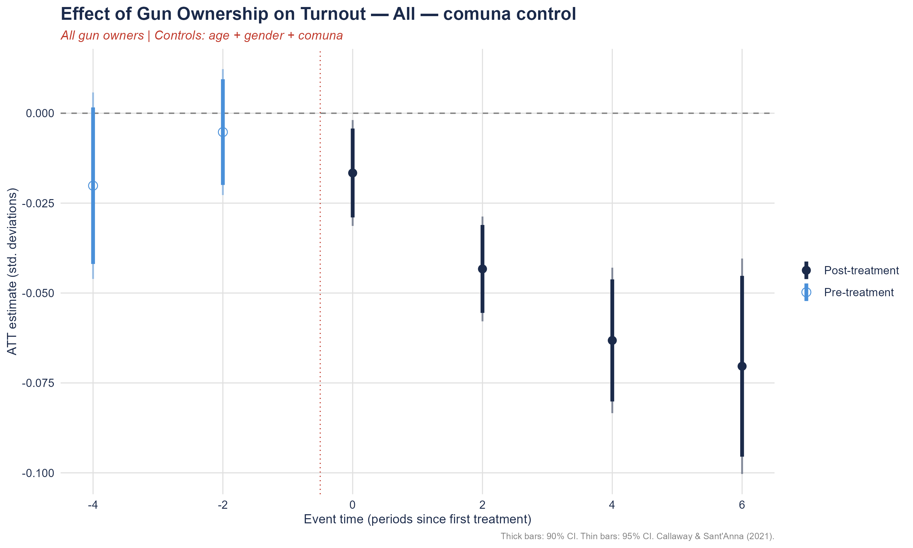

## The Conventional Wisdom {background-color="#1C2B4A"}

::: {.fragment .fade-out fragment-index="1" style="color: white; font-size: 1.8em; font-weight: 700; text-align: center; margin-top: 80px; line-height: 1.3; position: absolute; width: 100%;"}
Gun owners vote **more** than non-owners
:::

::::::::: {.fragment .fade-up .columns fragment-index="1" style="margin-top: 10px;"}
::: {style="color: white; font-size: 0.75em; text-align: center; margin-bottom: 16px; width: 100%;"}
Gun owners vote **more** than non-owners
:::

:::: {.column width="47%"}
**United States (1972–2016)**



::: {style="color: #aaa; font-size: 0.6em;"}
Source: Joslyn (2020)
:::
::::

::::: {.column width="53%"}
:::: {.fragment fragment-index="2"}
**Buenos Aires (2015–2023)**



::: {style="color: #aaa; font-size: 0.6em;"}
Source: National Electoral Court & ANMAC
:::
::::
:::::
:::::::::

## Voting patterns depend on affiliation (Buenos Aires (2015–2023))

::: {style="text-align: center;"}

:::

------------------------------------------------------------------------

## The Puzzle {background-color="#1C2B4A"}

::: {.fragment .fade-out fragment-index="1" style="color: white; font-size: 1.8em; font-weight: 700; text-align: center; margin-top: 120px; line-height: 1.4; position: absolute; width: 100%;"}
Gun owners vote **more** —\
but does *acquiring* a gun **cause** higher participation?
:::

:::::: {.fragment .fade-up fragment-index="1" style="text-align: center; margin-top: 60px;"}
::: {style="color: white; font-size: 1.0em; font-weight: 600; margin-bottom: 40px;"}
Gun owners vote **more** — but does *acquiring* a gun **cause** higher
participation?
:::

:::: {.fragment fragment-index="2" style="background-color: #1C2B4A; border: 2px solid #C0392B; border-left: 6px solid #C0392B; padding: 20px 30px; border-radius: 6px; font-size: 0.9em; max-width: 700px; margin: 0 auto; color: white;"}
Registering a firearm **causes** a decline in voter turnout\
of 2–7 percentage points, growing over time

**→ Arming is an exit decision**

::: {style="font-size: 0.7em; color: #aaa; margin-top: 10px;"}
Gonzalez & Visconti (Working Paper)
:::
::::
::::::

## Acquiring a Gun in Argentina

:::::::: columns
::::: {.fragment .fade-right .column fragment-index="1" width="50%"}
### The *Legítimo Usuario* License

To legally own a firearm, individuals must obtain a **Legítimo Usuario**
license from **ANMAC** (National Agency for Controlled Materials):

::: {style="font-size: 0.82em; margin-top: 12px;"}
1.  📋 Submit application with DNI (national ID)
2.  🧠 Pass psychological and aptitude tests
3.  🏥 Pass medical examination
4.  👮 Pass criminal background check
5.  💰 Pay registration fee
6.  🔫 Register each firearm individually
:::

::: {style="background-color: #FEF3F2; border-left: 4px solid #C0392B; padding: 12px; border-radius: 4px; font-size: 0.78em; margin-top: 16px; color: #1C2B4A;"}
All registrations are **timestamped by DNI** — allowing us to identify
the precise moment each individual entered gun ownership
:::
:::::

:::: {.fragment .fade-left .column fragment-index="2" width="50%"}
### Electoral Obligations

Argentina has **compulsory voting** for citizens aged 18–70:

::: {style="font-size: 0.82em; margin-top: 12px;"}
-   🗳️ Abstention triggers an **administrative fine**
-   📝 Citizens can justify absence or **pay the fine**
-   🔒 Non-compliance affects access to public services
:::
::::
::::::::

## Data

```{r, warning=FALSE, message=FALSE}
library(tidyverse)
library(knitr)
load("C:/Users/User/Dropbox/Guada/FirearmsPoliticalMobilization/Presentation/code/data_save.Rdata")
# Generar tabla de ejemplo
data_example %>%
  ungroup() |> 
  # Anonimizar DNI
  slice(1:10) %>%
  knitr::kable()
```

::: {style="font-size: 0.65em; color: #7F8C8D; margin-top: 8px;"}
**Data Sources:** ANMAC, National Electoral Chamber.
:::

## Sample Overview

::::: columns
::: {.column width="50%"}
<br>

### Who is in the sample?

| Statistic         | Value   |
|-------------------|---------|
| Total individuals | 218,514 |
| Gun owners        | 17,194  |
| Gun owners (%)    | 7.87%   |
| Male (%)          | 50.8%   |
| Mean age (years)  | 50.7    |
:::

::: {.column width="50%"}
<br>

### Demographics by Gun Owner Type

| User Type    | N       | Mean Age | Male (%) |
|--------------|---------|----------|----------|
| No gun       | 201,320 | 50.2     | 47.2%    |
| Individual   | 12,760  | 57.0     | 93.0%    |
| Police       | 3,263   | 56.8     | 91.5%    |
| Armed Forces | 1,031   | 58.0     | 95.2%    |
| Penitentiary | 140     | 54.7     | 95.7%    |
:::
:::::

::: {style="position: absolute; bottom: 20px; right: 20px; font-size: 0.65em;"}
[Treatment group composition](#app-treatment){.btn} [Balance
Table](#app-balance){.btn}
:::

------------------------------------------------------------------------

## Research Design

::::::::::: columns
::::: {.column width="55%"}
::: {.fragment fragment-index="1"}
**Identification Strategy**

Staggered Difference-in-Differences (Callaway & Sant'Anna, 2021)
:::

::: {.fragment fragment-index="2"}
|  |  |
|------------------------------------|------------------------------------|
| **Treatment** | First election *after* gun registration (If registered in year *t*, treated from *t+1*) |
| **Comparison** | Never-registered individuals |
| **Covariates** | Age, gender, comuna fixed effects |
:::
:::::

::::::: {.column width="45%"}
:::: {.fragment fragment-index="3"}
**Key Identifying Assumption**

::: {style="background-color: #EAF2FB; padding: 16px; border-radius: 6px; font-size: 0.85em; border-left: 4px solid #2E86C1;"}
*In the absence of gun registration, treated and never-treated
individuals would have followed parallel turnout trajectories*
:::
::::

<br>

:::: {.fragment fragment-index="4"}
**Validation**

::: {style="background-color: #EAFAF1; padding: 16px; border-radius: 6px; font-size: 0.82em; border-left: 4px solid #28B463;"}
✅ Pre-treatment coefficients centered near zero

✅ Robust to excluding 2021 (COVID midterm)

✅ Robust to comuna controls
:::
::::
:::::::
:::::::::::

------------------------------------------------------------------------

## Results: Turnout Declines After Gun Registration

::: {style="text-align: center;"}
**All gun owners**

{width="70%"}
:::

## Results: Turnout Declines After Gun Registration {visibility="uncounted"}

::::: columns
::: {.column width="50%"}
**All gun owners**


:::

::: {.column width="50%"}
:::
:::::

## Results: Turnout Declines After Gun Registration {visibility="uncounted"}

::: {style="text-align: center;"}
**Individual owners only**

{width="70%"}
:::

## Results: Turnout Declines After Gun Registration {visibility="uncounted"}

::::: columns
::: {.column width="50%"}
**All gun owners**


:::

::: {.column width="50%"}
**Individual owners only**


:::
:::::

::: {style="text-align: center; font-size: 0.78em; margin-top: 10px;"}
Effects grow over time: **−2pp at impact → −7pp six elections later**.
Pre-trends flat.
:::

::: {style="position: absolute; bottom: 20px; right: 20px; font-size: 0.65em;"}
[Model Results (All)](#app-all){.btn} [Model Results
(Individuals)](#app-individuals){.btn}
:::

------------------------------------------------------------------------

## Heterogeneity by Owner Type

::::: columns
::: {.column width="50%"}
**Police owners** 
:::

::: {.column width="50%"}
**Military owners** ⚠️ 
:::
:::::

::: {style="font-size: 0.78em; margin-top: 10px;"}
Police: similar negative pattern. Military: **pre-trends violated**.
:::

::: {style="position: absolute; bottom: 20px; right: 20px; font-size: 0.65em;"}
[Model Results (Military)](#app-military){.btn} [Model Results
(Police)](#app-police){.btn}
:::

------------------------------------------------------------------------

## Robustness

::::: columns
::: {.column width="50%"}
**Excluding 2021 (COVID midterm)**

:::

::: {.column width="50%"}
**With comuna controls** 
:::
:::::

::: {style="font-size: 0.78em; margin-top: 10px;"}
Results are **stable** across all robustness checks — estimates not
driven by COVID shock or neighborhood-level confounders.
:::

------------------------------------------------------------------------

## Conclusion

-   Gun registration **causes** a decline in voter turnout of 2–7pp,
    growing over time
-   Effects concentrated among **individual** and **police** owners
-   Turnout declines are **conservative** — compulsory voting
    mechanically compresses the effect

## Thank you! {background-color="#1C2B4A"}

:::::::::::::::::::: {style="text-align: center; margin-top: 30px;"}
::: {style="color: #C0392B; font-size: 2.2em; font-weight: 700; margin-bottom: 4px;"}
Questions? 🙋
:::

::: {style="color: white; font-size: 1.3em; font-weight: 600; margin-bottom: 4px;"}
Guadalupe Gonzalez
:::

::: {style="color: #aaa; font-size: 0.78em; margin-bottom: 40px;"}
PhD Student, Department of Government and Politics · University of
Maryland, College Park
:::

::: {style="border-top: 1px solid #2E4A7A; width: 60%; margin: 0 auto 40px auto;"}
:::

::::::::::::::: {style="display: flex; justify-content: center; gap: 60px;"}
::::: {style="text-align: center;"}
::: {style="color: #aaa; font-size: 0.7em; text-transform: uppercase; letter-spacing: 1px; margin-bottom: 6px;"}
🌐 Website
:::

::: {style="color: white; font-size: 0.82em;"}
[guadagonzalez.com](https://guadagonzalez.com/)
:::
:::::

::::: {style="text-align: center;"}
::: {style="color: #aaa; font-size: 0.7em; text-transform: uppercase; letter-spacing: 1px; margin-bottom: 6px;"}
💼 LinkedIn
:::

::: {style="color: white; font-size: 0.82em;"}
[guadag12](https://www.linkedin.com/in/guadag12)
:::
:::::

::::: {style="text-align: center;"}
::: {style="color: #aaa; font-size: 0.7em; text-transform: uppercase; letter-spacing: 1px; margin-bottom: 6px;"}
🎓 Google Scholar
:::

::: {style="color: white; font-size: 0.82em;"}
[Guadalupe
Gonzalez](https://scholar.google.com/citations?user=_3XZMDgAAAAJ&hl=en)
:::
:::::

::::: {style="text-align: center;"}
::: {style="color: #aaa; font-size: 0.7em; text-transform: uppercase; letter-spacing: 1px; margin-bottom: 6px;"}
📧 Email
:::

::: {style="color: white; font-size: 0.82em;"}
[guadag12\@umd.edu](mailto:guadag12@umd.edu)
:::
:::::
:::::::::::::::
::::::::::::::::::::

## Appendix: Treatment Cohorts {.appendix}

### Treatment group composition {#app-treatment}

| First treated (*g*) | N       | Interpretation                |
|---------------------|---------|-------------------------------|
| 0                   | 204,461 | Never treated (control group) |
| 2015                | 11,801  | Gun registered before 2015    |
| 2017                | 722     | Gun registered in 2015–2016   |
| 2019                | 831     | Gun registered in 2017–2018   |
| 2021                | 698     | Gun registered in 2019–2020   |

::: {style="font-size: 0.7em; color: #7F8C8D; margin-top: 12px;"}
*Note:* Group 2015 is dropped from the DiD estimation as units are
already treated in the first period of the panel. Sample restricted to
GENERALES elections.
:::

## Balance Table {#app-balance}

| Variable | Mean (Never Treated) | Mean (Treated) | SD (Never Treated) | SD (Treated) | p-value |
|------------|------------|------------|------------|------------|------------|
| Mean Age | 41.1 | 39.2 | 19.8 | 13.0 | \<0.001 |
| Proportion Male | 0.479 | 0.920 | 0.500 | 0.272 | \<0.001 |
| Birth Year | 1974 | 1976 | 19.8 | 13.0 | \<0.001 |

::: {style="font-size: 0.7em; color: #7F8C8D; margin-top: 12px;"}
*Note:* Pre-treatment covariate balance between treated and
never-treated units. p-values from two-sided t-tests. {#tbl-balance}
:::

## Turnout — All Gun Owners {#app-all}

| Event Time | All — base | All — comuna control | All — excl. 2021 | All — excl. 2021 cohort |
|---------------|:-------------:|:-------------:|:-------------:|:-------------:|
| e = -4 | -0.0191 (0.0139) | -0.0202 (0.0132) | -0.0191 (0.0132) | — |
| e = -2 | -0.0052 (0.0091) | -0.0052 (0.0089) | -0.0052 (0.0092) | 0.0000 (0.0129) |
| e = 0 | -0.0167\* (0.0074) | -0.0166\* (0.0075) | -0.0084 (0.0089) | -0.0084 (0.0083) |
| e = 2 | -0.0432\* (0.0079) | -0.0433\* (0.0074) | -0.0452\* (0.0102) | -0.0334\* (0.0098) |
| e = 4 | -0.0628\* (0.0102) | -0.0632\* (0.0103) | -0.0809\* (0.0142) | -0.0628\* (0.0106) |
| e = 6 | -0.0681\* (0.0153) | -0.0704\* (0.0153) | -0.0681\* (0.0148) | -0.0681\* (0.0144) |
| **Overall ATT** | **-0.0477\* (0.0077)** | **-0.0484\* (0.0075)** | **-0.0507\* (0.0081)** | **-0.0432\* (0.0082)** |

::: {style="text-align: center; font-size: 0.7em;"}
Standard errors in parentheses. \* 95% CI excludes zero. Callaway &
Sant'Anna (2021). Note: pre-trend test p = 0.033.
:::

## Turnout — Individual Gun Owners {#app-individuals}

| Event Time      |   Individuals — base   |  Individuals — comuna  |
|-----------------|:----------------------:|:----------------------:|
| e = -4          |    -0.0192 (0.0149)    |    -0.0205 (0.0146)    |
| e = -2          |    -0.0145 (0.0096)    |    -0.0143 (0.0098)    |
| e = 0           |   -0.0222\* (0.0079)   |    -0.0224 (0.0088)    |
| e = 2           |   -0.0515\* (0.0091)   |   -0.0517\* (0.0093)   |
| e = 4           |   -0.0597\* (0.0111)   |   -0.0601\* (0.0123)   |
| e = 6           |   -0.0721\* (0.0172)   |   -0.0741\* (0.0179)   |
| **Overall ATT** | **-0.0514\* (0.0085)** | **-0.0521\* (0.0088)** |

::: {style="text-align: center; font-size: 0.7em;"}
Standard errors in parentheses. \* 95% CI excludes zero. Callaway &
Sant'Anna (2021). Note: pre-trend test p = 0.033.
:::

## Turnout — Military Gun Owners {#app-military}

| Event Time      |   Military — base   |  Military — comuna  |
|-----------------|:-------------------:|:-------------------:|
| e = -4          |  -0.1228 (0.0874)   |  -0.1227 (0.0930)   |
| e = -2          |  0.1676\* (0.0613)  |  0.1669\* (0.0598)  |
| e = 0           |   0.0177 (0.0490)   |   0.0188 (0.0501)   |
| e = 2           |   0.0427 (0.0489)   |   0.0433 (0.0534)   |
| e = 4           |  -0.0522 (0.0711)   |  -0.0526 (0.0660)   |
| e = 6           |   0.0806 (0.0798)   |   0.0789 (0.0823)   |
| **Overall ATT** | **0.0222 (0.0450)** | **0.0221 (0.0428)** |

::: {style="text-align: center; font-size: 0.7em;"}
Standard errors in parentheses. \* 95% CI excludes zero. Callaway &
Sant'Anna (2021). Note: pre-trend test p = 0.033.
:::

## Turnout — Police Gun Owners {#app-police}

| Event Time      |     Police — base      |    Police — comuna     |
|-----------------|:----------------------:|:----------------------:|
| e = -4          |    0.0214 (0.0284)     |    0.0210 (0.0291)     |
| e = -2          |    -0.0182 (0.0176)    |    -0.0190 (0.0187)    |
| e = 0           |    -0.0093 (0.0134)    |    -0.0086 (0.0142)    |
| e = 2           |    -0.0349 (0.0149)    |    -0.0349 (0.0153)    |
| e = 4           |   -0.0830\* (0.0220)   |   -0.0837\* (0.0224)   |
| e = 6           |    -0.0858 (0.0373)    |   -0.0896\* (0.0343)   |
| **Overall ATT** | **-0.0533\* (0.0161)** | **-0.0542\* (0.0153)** |

::: {style="text-align: center; font-size: 0.7em;"}
Standard errors in parentheses. \* 95% CI excludes zero. Callaway &
Sant'Anna (2021). Note: pre-trend test p = 0.033.
:::
