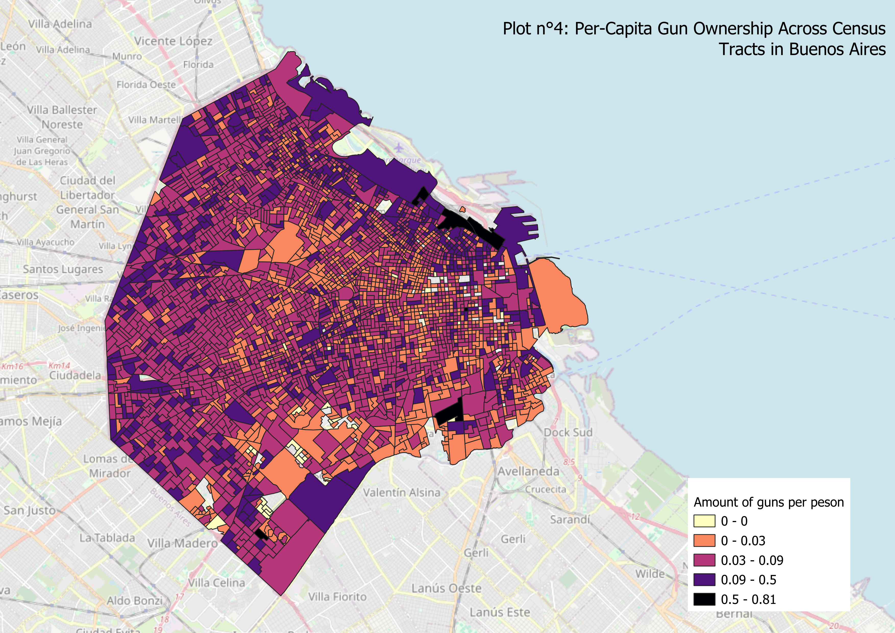
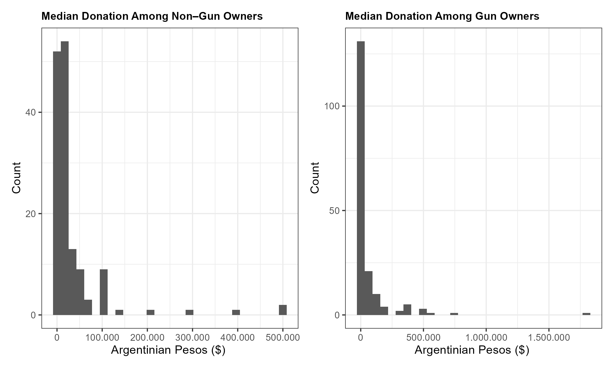

##  {background-color="#1C2B4A"}

::: {style="font-size:3.2em; font-weight:800; line-height:1.3; color:#FFFFFF; font-family:Georgia, serif;"}
Why do citizens who have privatized security maintain political engagement?
:::

## Gun Owners Vote More — In Two Very Different Contexts

::: {.fragment .fade-out fragment-index="1" style="color: white; font-size: 1.8em; font-weight: 700; text-align: center; margin-top: 80px; line-height: 1.3; position: absolute; width: 100%;"}
Gun owners vote **more** than non-owners
:::

::::::: {.fragment .fade-up .columns fragment-index="1" style="margin-top: 10px;"}
::: {style="color: white; font-size: 0.75em; text-align: center; margin-bottom: 16px; width: 100%;"}
Gun owners vote **more** than non-owners
:::

::: {.column width="47%"}
**United States (1972–2016)**

:::

:::: {.column width="53%"}
::: {.fragment fragment-index="2"}
**Buenos Aires (2015–2023)**

:::
::::
:::::::

::: fig-note
Left: @joslyn2020, U.S. 1972–2016. Right: National Electoral Court & ANMAC, Buenos Aires 2015–2023.
:::

## The Existing Literature Cannot Explain This

::: columns
::: {.column width="50%"}

The usual explanations don't apply here

<!-- Item 1: appears clean first (index 1), struck out on next click (index 2) -->

  Second Amendment culture &amp; constitutional identity
  (Shapira &amp; Simon, 2018; Lacombe et al., 2024)

✗ Argentina has no Second Amendment

<!-- Item 2: appears clean (index 3), struck out (index 4) -->

  Organised gun-rights lobby (NRA-type groups)
  (Lacombe et al., 2024)

✗ No equivalent organisation in Argentina

<!-- Item 3: appears clean (index 5), struck out (index 6) -->

  Collective political identity around gun ownership
  (Higginbotham, 2025; Buttrick, 2020)

✗ Gun owners don't act as a political group

:::

::::: {.column width="50%"}
:::: {.fragment data-fragment-index="7"}
::: {style="background:#1C2B4A; border-radius:8px; padding:18px 20px; margin-top:10px;"}

So what is driving this?

Every existing explanation requires either a **cultural identity** around guns or an **organizational infrastructure** that mobilizes owners collectively.

→ Argentina has neither.

:::
::::
:::::
:::::::::::::

## Where Do Gun Owners Live?

{width="70%"}

## Where Do Gun Owners Live?

{width="70%"}

## Patterns

- Highest density near administrative boundaries of *villas* and *barrios populares*

- Random: Spatial clustering suggests a boundary-driven logic, not purely income-based sorting

- The strategy: Use the administrative boundary as a geographic discontinuity (RDD)

## The Mechanism

::::::::::::::: columns
:::: {.column width="32%"}
::: fragment
### 1. Substitution

Citizens do not delegate their security in the state anymore. They privatize their security [@kessler2009; @yashar2018]
:::
::::

::::: {.column width="2%"}
:::: fragment
::: arrow-center
→
:::
::::
:::::

:::: {.column width="32%"}
::: fragment
### 2. The Paradox

Although, the same citizens who armed themselves in rejection of the state continue to vote, donate, and engage politically. Why would someone who replaced the state still invest in it? [@joslyn2020]
:::
::::

::::: {.column width="2%"}
:::: fragment
::: arrow-center
→
:::
::::
:::::

:::: {.column width="32%"}
::: fragment
### 3. Engaged Toleration

They participate because of strategic tolerance: enough engagement to keep the state functional, no more. [@holland2017; @levi1988]
:::
::::
:::::::::::::::

## Inverted Forbearance

::::::::::::: columns
:::::: {.column width="47%"}
#### Holland's Forbearance [-@holland2017]

::: fragment
**State → Citizens**
:::

::: {.fragment}
-  When the state cannot or will not enforce its own rules, it tolerates non-compliance rather than confronting it, preserving the relationship at the cost of enforcement

[@holland2017, @brinks2020]
:::

::: {.fragment}
**Result:** Ongoing institutional relationship maintained through strategic non-enforcement
:::
::::::

:::: {.column width="6%"}
::: fragment
⇄
:::
::::

:::::: {.column width="47%"}
::: fragment
#### Inverted Forbearance

**Citizens → State**
:::

::: fragment
- Gun owners do not abandon the state politically because they still believe in a **minimal version of it**, one that maintains basic order, even if it failed at security. They tolerate the gap between the state they have and the state they want.
:::

::: fragment
**Result:** Stable participation, without enthusiasm, not exit. Citizens engaging with a state they have partially replaced but not fully rejected.
:::
::::::
:::::::::::::

## Research Design

:::::: columns
::: {.column width="52%"}
### Design Logic

**Running variable**\
Signed distance to the administrative boundary of the nearest *barrio popular*/villa\
(inside \< 0, outside \> 0)

**Cutoff**\
The official administrative limit
:::

::: {.column width="4%"}
:::

::: {.column width="44%"}
### Outcomes

**Primary:** Gun ownership rate per census tract

**Secondary:** Turnout · Donations · Hearing attendance
:::
::::::

:::::::::

## Limitations and next steps:

::: fragment
1. Data Collection in villas but also at Camara Nacional Electoral
:::

::: fragment
2. Does "inverted forbearance" the best term to describe an increase in participation modest?
:::
::: fragment
3. There are ongoing projects to continue study the relationship between the state and gun owners:
:::

::: fragment
a. Working paper @gonzalez2026]
b. Natural Experiment on Historical Legacies with Sebastian Cortesi.
c. Interviews with Gun Owners soon in Argentina!
:::

## References {.smaller}

::: {#refs}
:::

## Preliminary Evidence

::::: columns
::: {.column width="50%"}
**Donation Distribution**

{width="100%"}

:::

::: {.column width="50%"}
**Effect of Gun Ownership on Turnout (DiD)**

:::
:::::

## The Puzzle

### What Theory Predicts

**Citizens who privatize security should exit**

[@hirschman1972]: when private substitutes exist, citizens disengage from the state

::: {style="color:#a61707;"}
-   **Less voting, less donating, less engagement**
:::

Crime shocks increases the exit from politics [@gonzalez2026] :::::

::: {.column width="6%"}
$\neq$
:::

### What We Actually See

**Gun owners participate more, not less**

-   Higher turnout than non-owners
-   Higher donations than non-owners
-   Stable engagement over time

::: highlight-blue
-   **Why do gun owners remain engaged?**
:::

This is the puzzle this paper solves.

