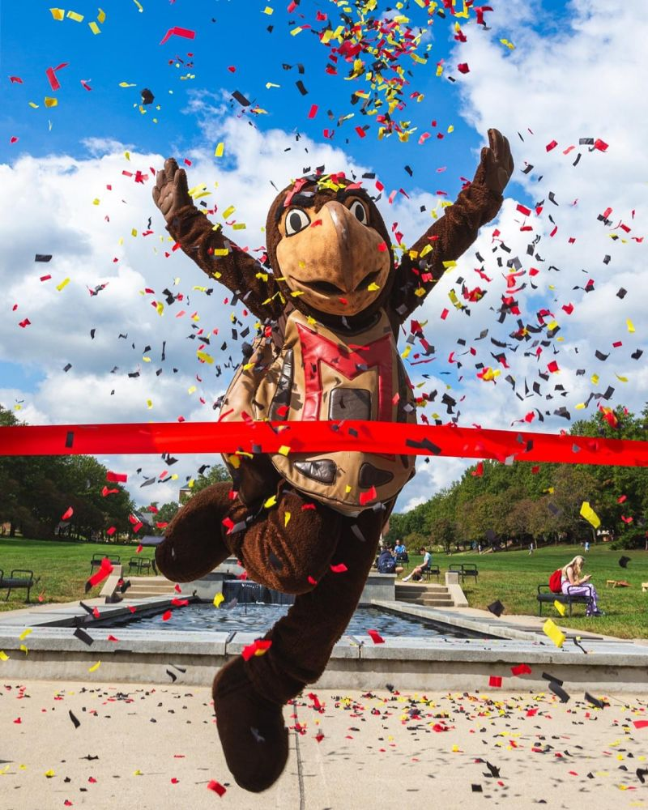
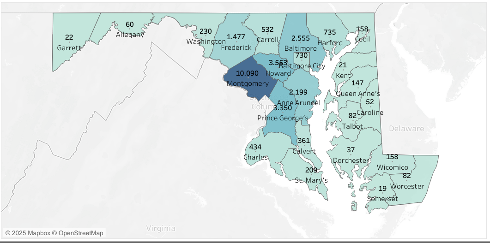

## Quarto

::: {.fragment}

Quarto enables you to weave together content and executable code into a finished presentation. To learn more about Quarto presentations see <https://quarto.org/docs/presentations/>. Here we will see different ways of customize your presentation using UMD theme! 

:::

::: {.fragment}
If you are using Generative AI to make this presentation pay attention to this recommendations of @perkel2023chatgpt.
::: 

---

# HEADING 1

## HEADING 2

### HEADING 3

#### HEADING 4

##### HEADING 5

###### HEADING 6

---

Words can be **bold**, _italicized_, <u>underlined</u>, ~~strikethrough~~, <span class="highlight-word">highlighted words</span>, insert code: `head()`,  or even [hyperlinked](https://umd.edu/)!

---

Bullets can be used for ordered or unordered lists:

## Ordered lists:

::: {.incremental}

1. ordered list
2. item 2
    i) sub-item 1
         A.  sub-sub-item 1
::: 

---

## Unordered lists:

:::: {.columns}

::: {.column width="50%"}

::: {.incremental}


* My name is Guada
* I'm a Phd Student at UMD!
* I'm from Argentina:
  + It is a really nice place in South America
  + We have the best: 
    - asado (barbicue), 
    - dulce de leche (caramel sauce) and 
    - empanadas
:::

:::

:::{.column width="50%"}

:::

::::

---

## Task lists

- [ ] Task 1
- [x] Task 2

---

## Images

Images can be added in Quarto in different ways:

::: {.r-stack}
{.fragment  width="750" height="600"}

{.fragment  width="600" height="750"}

{.fragment  width="600" height="750"}

{.fragment  width="600" height="750"}


:::

---

## Show your R code!

Code can be embebed in Quarto like this: 


```{r}
result <- 1 + 1
result
```


---

## O don't show it, show the results only!

We can hide the code and show the results only:

```{r}
cat("Go terps!")
```

---

## {auto-animate=true}

::: {style="margin-top: 200px; font-size: 3em; color: red;"}
Create columns to explain a topic
:::

## {auto-animate=true}


::: columns
::: {.column width="40%"}

### Did you know that Montgomery County has the highest enrollment at UMD?


:::

::: {.column width="60%"}



Source: Office of Institutional Research, Planning & Assessment at University of Maryland

:::
:::


---

## Inverse Slide {.inverse}

This slide has dramatically different styling with an inverse color scheme.

- The background is yellow.
- The text is grey.


---

## Add tabsets to explain more in depth some issue!

::: {.panel-tabset .nav-pills}

### Tab Number 1

This is tab number 1 . Check some **fun facts**🌟 

### Fun Fact 1

{fig-align="center" width="800px"}

### Fun Fact 2

{fig-align="center" width="800px"}

:::

---

## We can add notes!

::: {.fragment}

::: {.callout-note}
Note that there are five types of callouts, including:
`note`, `warning`, `important`, `tip`, and `caution`.
:::

:::

::: {.fragment}

::: {.callout-tip}
## Tip with Title

This is an example of a callout with a title.
:::

:::

::: {.fragment}

::: {.callout-important}
## This is an important message

Use this when you are showing important information.
:::

:::


::: {.fragment}

::: {.callout-caution}
## Caution

Use this when the viewer have to pay attention to something.

:::

:::

---

## goterps R package has also a theme in ggplot2!

```{r, eval=FALSE}
library(ggplot2)
ggplot(data = iris, aes(x = Sepal.Length, y = Sepal.Width)) +
  geom_point(size = 4) +
  goterps_theme() +
  scale_fill_manual(values = goterps_palette_d()) +
  labs(title = "Scatter Plot of Iris Data Colored by Species",
       x = "Sepal Length",
       y = "Sepal Width")
```


---

## Have palette of colors for discrete variables: 

```{r, eval=FALSE}
ggplot(data = iris, aes(x = Sepal.Length, y = Sepal.Width, color = Species)) +
  geom_point(size = 4) +
  scale_color_manual(values = goterps_palette_d(3)) +
  goterps_theme() +
  scale_fill_manual(values = goterps_palette_d()) +
  labs(title = "Scatter Plot of Iris Data Colored by Species",
       x = "Sepal Length",
       y = "Sepal Width",
       color = "Species")
```


---

## And have palette of colors for continuous variables: 

```{r, eval=FALSE}
library(ggplot2)
p1 <- ggplot(iris[iris$Species == "setosa",], aes(x = Sepal.Width, y = Sepal.Length, color = Sepal.Length)) +
  geom_point(size = 4) +
  scale_color_gradientn(colors = goterps_palette_c("yellow",5)) +
  labs(x = "Sepal Width", y = "Sepal Length",
       title = "Scatter Plot of Iris Data Colored by Species") +
  goterps_theme() +
  theme(plot.title = element_text(hjust = 0.5))

p2 <-ggplot(iris[iris$Species == "versicolor",], aes(x = Sepal.Width, y = Sepal.Length, color = Sepal.Length)) +
  geom_point(size = 4) +
  scale_color_gradientn(colors = goterps_palette_c("red",5)) +
  labs(x = "Sepal Width", y = "Sepal Length") +
  goterps_theme() +
  theme(plot.title = element_text(hjust = 0.5))

p3 <-ggplot(iris[iris$Species == "virginica",], aes(x = Sepal.Width, y = Sepal.Length, color = Sepal.Length)) +
  geom_point(size = 4) +
  scale_color_gradientn(colors = goterps_palette_c("grey",5)) +
  labs(x = "Sepal Width", y = "Sepal Length") +
  goterps_theme() +
  theme(plot.title = element_text(hjust = 0.5))

grid.arrange(p1, p2, p3)
```


---

## References

::: {#refs}

:::

::: {.center .middle}

## Thank You for Your Attention! Questions?

</br>

[`r fontawesome::fa("envelope")` guadag12\@umd.edu](mailto:guadag12@umd.edu)

[`r fontawesome::fa("link")` https://guadagonzalez.com/](https://guadagonzalez.com/)

[`r fontawesome::fa("github")` \@guadag12](http://github.com/guadag12)
:::

